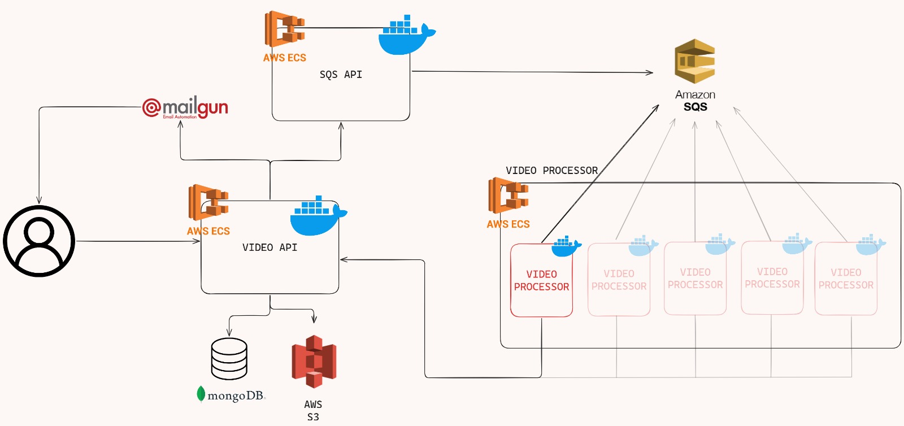

# Conversor de MP4 para zip de arquivos PNG dos frames

Esse serviço tem como objetivo escutar uma fila da AWS, que irá enviar o ID de um vídeo que deve ser processado e transformado em frames.

## Autores

- [@piovezan1207](https://www.github.com/piovezan1207)
- [@maurimurakami](https://www.github.com/maurimurakami)
- [@pinheirojks](https://www.github.com/pinheirojks)

## Arquitetura

A Arquitetura sugerida para uso dessa aplicação, é a indicada a baixo (o processo em vermelho é o referente a esse repositório):



## Deploy

Para fazer o deploy desse projeto rode

```bash
  git clone https://github.com/TechChallengeFiap-7SOT/get-frames-video
```

```bash
  docker build -t "get-frames-video" .
```

```bash
  docker run -v {PWD}/.env:/app/.env get-frames-video
```

Lembrese de configurar o .env, conforme sessão variáveis de ambiente.


## Variáveis de Ambiente

Para rodar esse projeto, você vai precisar adicionar as seguintes variáveis de ambiente no seu .env


`QUEUE_URL` URL da fila que será consultada

`AWS_ACCESS_KEY_ID` Credenciais AWS para consulta da fila

`AWS_SECRET_ACCESS_KEY` Credenciais AWS para consulta da fila

`AWS_SESSION_TOKEN` Credenciais AWS para consulta da fila

`URL_TO_SEND_ZIP` URL que o ZIP deve ser enviado apos estar pronto

`URL_TO_GET_VIDEO` URL para consultar a URL do video atraves do ID recebido pela fila


## Licença

[MIT](https://choosealicense.com/licenses/mit/)

